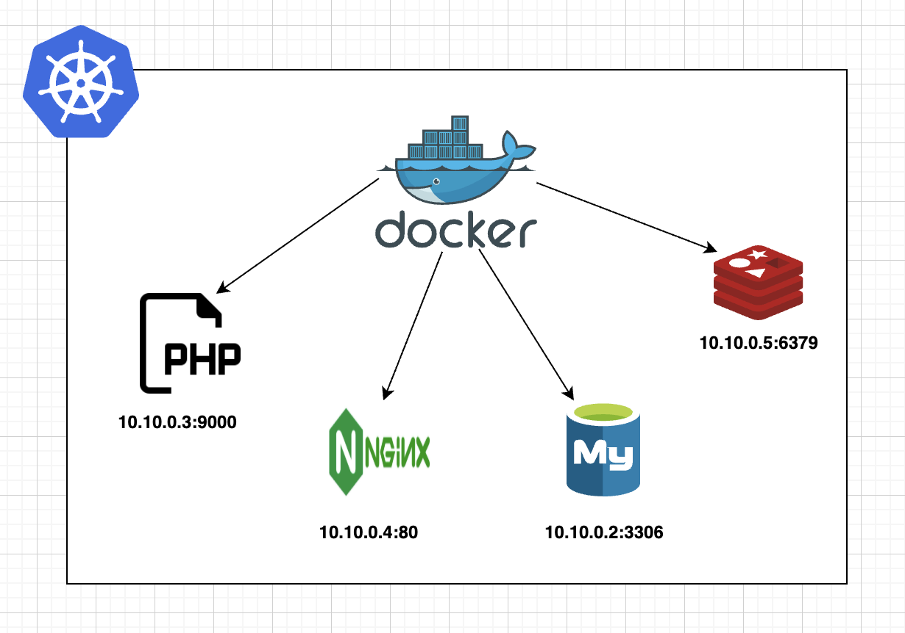

# Goku-V1

Gogo is the standard development environment used to deploy your app locally or in production, with minimal resource usage to optimize your infrastructure

<div align="center">

# containerize-php-app

</div>



## Project Requirements
	•	Containerized application using PHP, Nginx, MySQL, and Redis
	•	Simple PHP application code for demonstration
	•	CI/CD setup using GitHub Actions
	•	Deployment to Kubernetes (K8s)

## 🚀 To get started quickly, just follow these steps:
💡 **Note**: Before starting the project locally, make sure you have Docker Desktop and Docker Compose installed on your system.

> - [Install Docker & Docker Compose on macOS](https://docs.docker.com/desktop/install/mac-install/)
> - [Install Docker & Docker Compose on Windows](https://docs.docker.com/desktop/install/windows-install/)

Once installed, you’re ready to spin up the environment locally.

## Clone the repository “Goku”
```sh
git clone https://github.com/mlouguid/Goku.git
cd Goku
```

## Infra Project

```sh
├── docker-compose.yaml
└── php/   # your-project
│    ├── public/
│    │   └── index.php
│    ├── src/
│    ├── composer.json
│    ├── Dockerfile
│    ├── .env
│
├── services/
│   ├── database/
│   │   ├── mysql/
│   │   │   ├── Dockerfile
│   │   │   ├── .env
│   │   ├── redis/
│   │   │   ├── Dockerfile
│   │   │   ├── .env
│   └── web/
│       ├── nginx/
│           ├── Dockerfile
│           ├── app.conf
│           ├── fastcgi_params
│           └── .env
│       
├── infra/
│   ├── k8s/
│       ├── deployments/
│       └── services/
```

## Deploy to Docker Compose

```sh
docker-compose up -d
```

## Deploy to k8s
```sh
kubectl apply -R -f infra/k8s 
```

