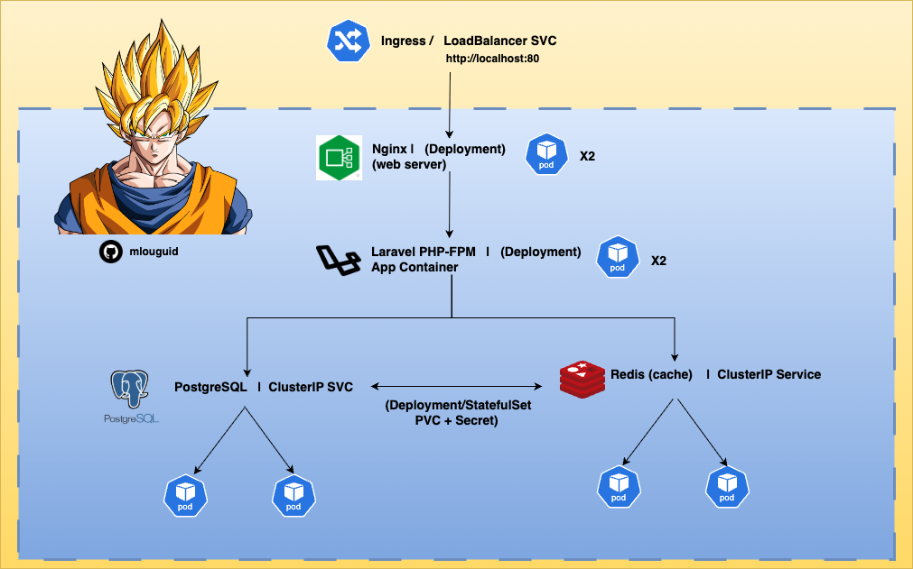

# Goku-V1.1

Gogo is the standard development environment used to deploy your app locally or in production, with minimal resource usage to optimize your infrastructure with docker or k8s

<div align="center">

# Goku app-php | Docker

</div>


## Project Requirements
	•	Containerized application using PHP, Nginx, PostgreSQL and Redis
	•	Simple PHP application code for demonstration
	•	CI/CD setup using GitHub Actions
	•	Deployment to Kubernetes (K8s)

## 🚀 To get started quickly, just follow these steps:
💡 **Note**: Before starting the project locally, make sure you have Docker Desktop and Docker Compose installed on your system.

> - [Install Docker & Docker Compose on macOS](https://docs.docker.com/desktop/install/mac-install/)
> - [Install Docker & Docker Compose on Windows](https://docs.docker.com/desktop/install/windows-install/)

Once installed, you’re ready to spin up the environment locally.

## Clone the repository “Goku”
```sh
git clone https://github.com/mlouguid/Goku.git
cd Goku
```

## Infra Project Docker

```bash
├── docker-compose.yaml
└── app-php/   # your-project
│    ├── public/
│    │   └── index.php
│    ├── src/
│    ├── composer.json
│    ├── Dockerfile
│    ├── .env
│
├── database
│   └── postgres
│       ├── Dockerfile
│       ├── .env
│       └── init.sql
│ 
├── nginx
│   ├── beta.conf
│   ├── Dockerfile
│   ├── .env
│   └── fastcgi_params
│ 
└── redis
    ├── Dockerfile
    ├── .env
    └── redis.conf      
```

## Deploy to Docker Compose

```sh
docker-compose up -d
```
---

# k8s

## Goku app-php | K8S



## Infra Project k8s
```sh
cd kubernetes

k8s
│   ├── deployments
│   │   ├── postgres.yaml  
│   │   ├── nginx.yaml
│   │   ├── php.yaml
│   │   └── redis.yaml
│   ├── pvc
│   │   ├── postgres_pv.yaml   
│   │   └── postgres_pvc.yaml 
│   ├── secrets
│   │   └── postgres_secrets.yaml  
│   └── services
│       ├── postgres_service.yaml 
│       ├── nginx_service.yaml
│       ├── php_service.yaml
│       └── redis_service.yaml
```

## Deploy to k8s

```sh
kubectl apply -R -f infra/k8s 
```

